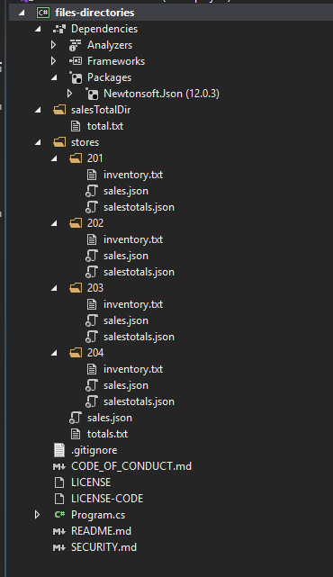

### Files And Directories

- Below is the project directory overview
- 

```c#
using Newtonsoft.Json;
using System;
using System.Collections.Generic;
using System.IO;
using System.Linq;

namespace files_directories
{
    internal record SalesTotal
    {
        public double Total { get; init; }

    }
    internal class Program
    {
        private static IEnumerable<string> findFiles(string path)
        {
            IEnumerable<string> files = Directory.EnumerateFiles(path, "*", SearchOption.AllDirectories);
            return files.Where(file => file.EndsWith("sales.json"));
        }

        private static double getSalesTotal(IEnumerable<string> files)
        {
            double total = 0;

            foreach (string file in files)
            {
                SalesTotal sales = JsonConvert.DeserializeObject<SalesTotal>(File.ReadAllText(file));
                total += sales.Total;
            }
            return total;
        }

        private static string GetProjectRootDirectory()
        {
            return Path.GetFullPath(Path.Combine(Directory.GetCurrentDirectory(), "../../.."));
        }

        private static void Main(string[] args)
        {
            string storesDirectory = Path.GetFullPath(Path.Combine(Directory.GetCurrentDirectory(), "../../../stores"));
            IEnumerable<string> files = findFiles(storesDirectory);
            foreach (string file in files)
            {
                Console.WriteLine(file);
            }

            string firstSalesFile = $"{storesDirectory}{Path.DirectorySeparatorChar}201{Path.DirectorySeparatorChar}sales{Path.GetExtension("sales.json")}";
            Console.WriteLine($"first sale file -> {firstSalesFile}");

            FileInfo firstSalesFileInfo = new FileInfo(firstSalesFile);
            Console.WriteLine($"FullName: {firstSalesFileInfo.FullName} {Environment.NewLine} Directory: {firstSalesFileInfo.Directory}");

            //Creating Directory and Files
            string salesTotalDir = Path.Combine(GetProjectRootDirectory(), "salesTotalDir");
            try
            {
                if (!Directory.Exists(salesTotalDir))
                {
                    Directory.CreateDirectory(salesTotalDir);
                    Console.WriteLine("Directory created successfully");
                }
                //File.WriteAllText(Path.Combine(salesTotalDir, "total.txt"), string.Empty);
            }
            catch (Exception ex)
            {
                Console.WriteLine($"Directory can not be created. Details -> {ex}");
            }

            double total = getSalesTotal(files);
            File.AppendAllText(Path.Combine(salesTotalDir, "total.txt"), $"{total:0.00}{Environment.NewLine}");
            Console.WriteLine("Total value has successfully written");

            Console.ReadLine();
        }
    }
}

```
