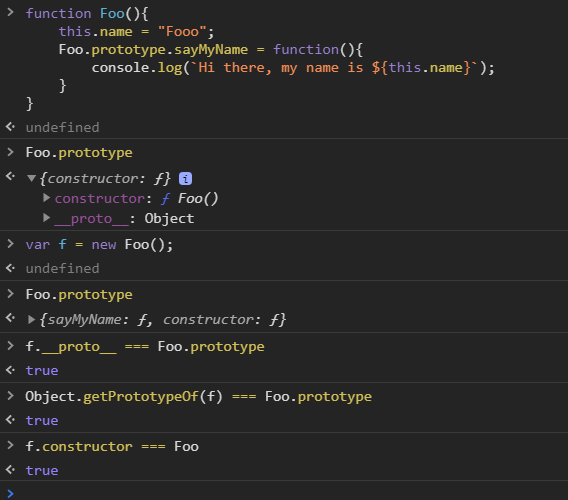

> What is the `[[ProtoType]]` mechanism in Javascript ?

- [[ProtoType]] is simply a reference which points from child object to base object.
- Objects in JavaScript have an internal property, denoted in the specification as [[Prototype]], 
 which is simply a reference to another object. Almost all objects are given a non-null value for this property, 
 at the time of their creation
 
 
```javascript
const obj = {a: 23};
//create anotherObj and makes it's [[ProtoType]] to obj. 
const anotherObj = Object.create(obj);
anotherObj.__proto__ === obj; //->true
obj.isPrototypeOf(anotherObj); //->true
Object.getPrototypeOf(anotherObj) === obj; // ->true 

//Even anotherObj does not have 'a' property, [[Get]] internal of the object will look up
//the object's [[ProtoType]] chain It will stop when property is found or 
//prototype chain is ended which is [[Object.ProtoType]]
console.log(anotherObj.a); //->23

const obj1 = {}
const obj2 = Object.create(obj1);
// Simply: does `obj1` appear anywhere in
// `obj2`s [[Prototype]] chain?
obj1.isPrototypeOf(obj2); //true

```
- In browsers there are a special `__proto__`(_dunder proto_) property(**actually a getter/setter**) to access an object `[[ProtoType]]`. In that days Javasript did not provide a formal way to get/set prototype of an object.
We can mimic this behaviour like below.
```javascript
Object.defineProperty(f,"___proto__",{
    get(){
        return Object.getPrototypeOf(this);
    },
    set(_proto){
        Object.setPrototypeOf(this,_proto);
        return _proto;
    }
})
```
- With ES6 there is no need to use `__proto__` getter/setter. See below code snippet
```javascript
function Foo(){
    this.name = "Fooo";
    Foo.prototype.sayMyName = function(){
        console.log(`Hi there, my name is ${this.name}`);
    }
}

Object.getPrototypeOf(f); //{sayMyName: ƒ, constructor: ƒ}
Object.setPrototypeOf(f,Foo.prototype);
```



***
### Property [[Get]] & [[Put]]
**If a property does not exist on the object, then how is obj.a = "blabla" work under the hood?**

1.If a normal data accessor property named foo is found anywhere higher on the `[[Prototype]] chain,
and it's not marked as `read-only (writable:false)` then a new property called foo is added directly to myObject, 
resulting in a shadowed property.
```javascript
//when define as object literal, writable - configurable - enumerable is true by default
const baseObj = {
    a: "12"
}
var myObject = Object.create(baseObj);
myObject: //{}
myObject.a = "345"; //shadowing prop "a"
myObject; //{a: "345"}
```
2.If a foo is found higher on the `[[Prototype]]` chain, but it's marked as read-only `(writable:false)`, then both the
setting of that existing property as well as the creation of the shadowed property on myObject are disallowed. 
If the code is running in **strict mode**, _an error will be thrown_. Otherwise, the setting of the property value will _silently be ignored._
Either way, no shadowing occurs.
```javascript
Object.defineProperty(baseObj,"b", {
    value: 49,    
    writable: false, //these 3 props are default as false when used by defineProperty method
    configurable: false,
    enumerable: false
});
baseObj: //{a: "12", b: 49}
myObject.b = 1234; //In strict mode throw error(readonly prop), Non-strict mode ignored
myObect.b; //49
```
3.If a foo is found higher on the `[[Prototype]]` chain and it's a `setter`, then the setter will always be called. 
No foo will be added to (aka, shadowed on) myObject, nor will the foo setter be redefined.
```javascript
Object.defineProperty(baseObj,"c", {
    //when using get and set, you can not provide value and writable props.
    get(){
        return c
    },
    set(val){
        c = val;
    },
    configurable: false,
    enumerable: false
});
baseObj.c = "laps";
baseObj.c; //"laps"
myObject.c; //"laps"

//Here no "c" prop is attached to myObject itself. Because "c" is a setter and in upper
//[[ProtoType]] set will be executed baseObj.c prop will be changed. Danger !!!
myObject.c = "Geronimo"; 
myObject.hasOwnProperty("c");//false
baseObj.c; //"Geronimo"
```
_Above restrictions only apply to `=` assignment, but is not enforced when using `Object.defineProperty(..)`._

**Shadowing** can be very dangerous. You should try to avoid it if possible
Shadowing can even occur implicitly in subtle ways, so care must be taken if trying to avoid it. Consider:
```javascript
var anotherObject = {
	a: 2
};

var myObject = Object.create( anotherObject );

anotherObject.a; // 2
myObject.a; // 2

anotherObject.hasOwnProperty( "a" ); // true
myObject.hasOwnProperty( "a" ); // false

myObject.a++; // oops, implicit shadowing!

anotherObject.a; // 2
myObject.a; // 3

myObject.hasOwnProperty( "a" ); // true
```
***
> When we create a `function` in javascript, automatically this **function objects** will have `prototype` property.
```javascript
function Foo(){

}
Foo.prototype; //{constructor: ƒ}.Automatically created "prototype" property. Here constructor refers back to Foo function. 
var a = new Foo();
Object.getPrototypeOf(f) === Foo.prototype; //true
```
- When a is created by calling `new Foo()`, one of the things  that happens is that a gets an internal `[[Prototype]]`
link to the object that `Foo.prototype` is pointing at.

- In class-oriented languages, multiple copies (aka, "instances") of a class can be made, like stamping something out
from a mold.This happens because the process of instantiating (or inheriting from) a class means, "copy the behavior plan from that class into a physical object", and this is done again for each new instance.

- But in JavaScript, there are no such copy-actions performed. You don't create multiple instances of a class. You can create multiple objects that [[Prototype]] link to a common object. But by default, no copying occurs, and thus these objects don't end up totally separate and disconnected from each other, but rather, quite linked.

- `new Foo()` results in a new object (we called it a), and that new object a is internally [[Prototype]] linked to the 
`Foo.prototype` object.

- **We end up with two objects, linked to each other**. That's it. We didn't instantiate a class. We certainly didn't do any copying of behavior from a "class" into a concrete object. We just caused two objects to be linked to each other.


***
### Constructor
- It's most appropriate to say that a "constructor" is **any function called with the `new` keyword in front of it**.
- Functions aren't constructors, but function calls are "constructor calls" if and only if `new` is used.
- When a function is created, automatically it's _prototype_ property is created and this _prototype_ object has a
**.constructor** property which points to Function itself.
- For one, the `.constructor` property on `Foo.prototype` is only there by default on the object created when Foo the function is declared. If you create a new object, and replace a function's default `.prototype` object reference, the new object will not by default magically get a .constructor on it.

Consider:
```javascript
function Foo() { }
Foo.prototype = { }; // create a new prototype object

var a1 = new Foo();
a1.constructor === Foo; // false!
a1.constructor === Object; // true!
```
What's happening? a1 has no `.constructor` property, so it delegates up the [[Prototype]] chain to Foo.prototype. But that object doesn't have a `.constructor` either (like the default Foo.prototype object would have had!), so it keeps delegating, this time up to `Object.prototype`, the top of the delegation chain. That object indeed has a `.constructor` on it, which points to the built-in `Object(..)` function.

- To fix that, after changing prototype of Foo, we have to manually define `constructor` again(_Lots of manuel work_)
```javascript
Object.defineProperty( Foo.prototype, "constructor" , {
	enumerable: false,
	writable: true,
	configurable: true,
	value: Foo    // point `.constructor` at `Foo`
} );
```

