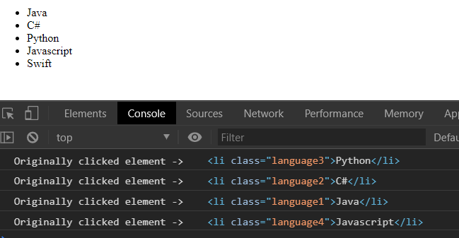

> Explain `event bubbling` vs. `event delegation` in javascript

- `Event Bubbling` _is the propagation of the event from its origin to the root element_. To prevent the propogation of the
event use **`event.stopPropagation()`**
- `Event Delegation`  simply leverages the event bubbling mechanism. Instead of listening all the child elements event, we only
attach a handler to parent element, and specify the source(event fire origin) via `event.target`
- **Pros** of `event delegation`
    - Code Quality will be imporoved with fewer event handlers
    - Less DOM manipulation
    - Performance would be improved
***
```html
<!DOCTYPE html>
<html>
	<head lang="en">
		<meta charset="utf-8"/>		
	</head>
<body>
 <div class="outer-div">
	 <div class="inner-div" >
		 <ul class="languages">
			 <li class="language1">Java</li>
			 <li class="language2">C#</li>
			 <li class="language3">Python</li>
			 <li class="language4">Javascript</li>
			 <li class="language5">Swift</li>
		 </ul>
	 </div>
 </div>
 <script>
	 const element = document.querySelector(".outer-div");
	 element.addEventListener("click",onouterdivclick)
	function onouterdivclick(event) {
		console.log("Originally clicked element -> ",event.target)
	}
</script> 
</body>
</html>
```
	

When we click on one of the list item, it will bubble up event to its root. ***Since the normal behavior of an element is
to propagate the events up in the hierarchy*** 

