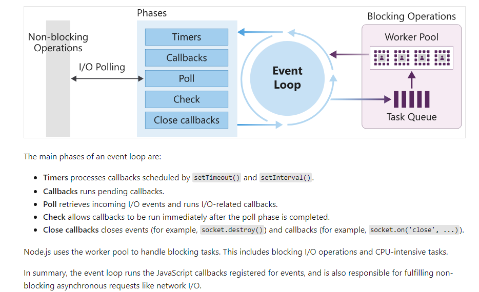

- `Node.js` is basically a wrapper around **Chromioum V8 engine**
- It enables us to write `javascript` in server side. That means you can be a real _fullstack developer_ with _javascript_
- `Node` also provides modules to work with file system(`fs`,`path` ...etc) and _databases_

### Node Architecture

